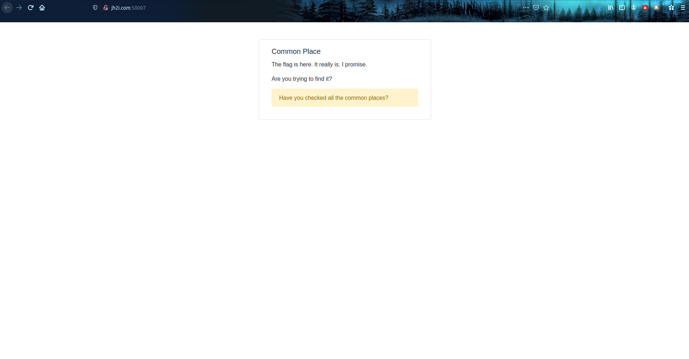

# Challenge: Common Place

## Description: 
```
asd7138: can you find the flag here?
tcm3137: no, i dont see it
jwh8163: i cant find it either
rfc5785: i found it
asd7138: what!? where?!
jwh8163: tell us!

Connect here:
http://jh2i.com:50007
```
## Points: 30

This challenge greets us with a page:


The first thing I did is examine the source code of the webpage for any clues. After searching through the source code, I have not found anything that would lead me to the flag, so the next thing I did was to check the robots.txt file. The file did not exist so I tried other filenames, like `flag.txt`, `common.txt`, `/common/` but no luck. The next thing I did was to search in the web archive and whois for any clues. One big clue i've found was in the description of the challenge. One of the users are called `rfc5785`. Upon searching in google we are greeted with the RFC `"Defining Well-Known Uniform Resource Identifiers (URIs)"` where it describes the `/.well-known/` directory, in there you will see the flag.