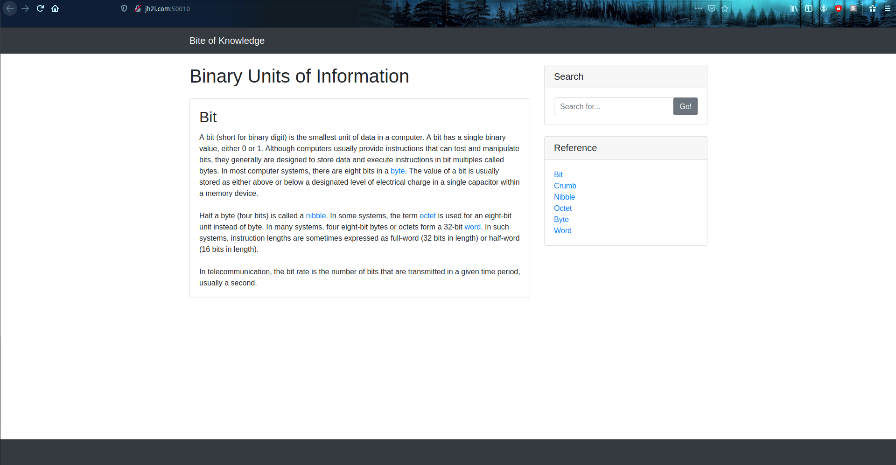
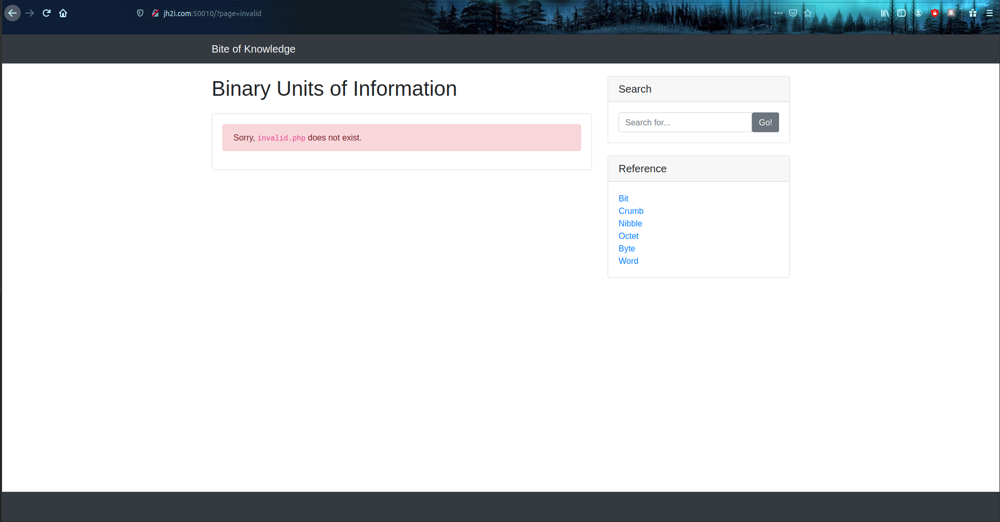
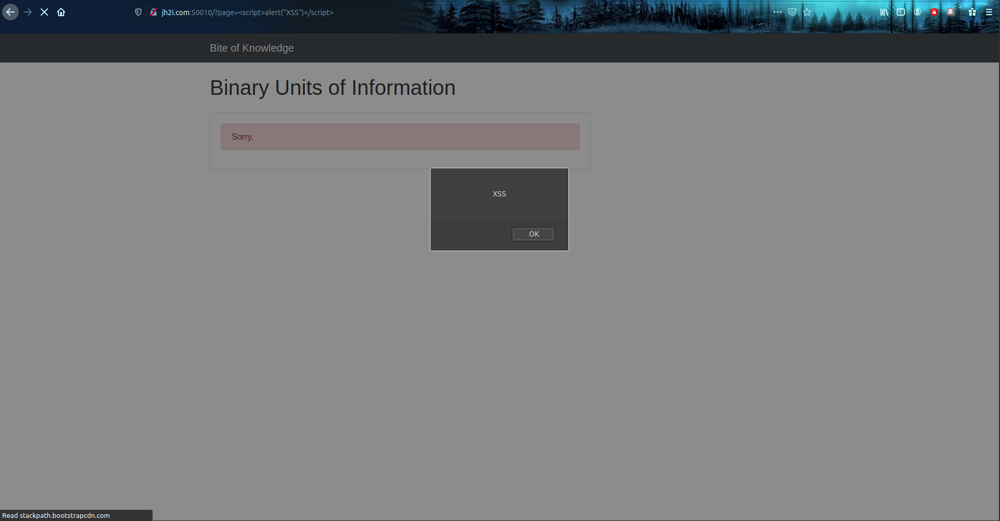

# Challenge: Bite

## Description: Want to learn about binary units of information? Check out the "Bite of Knowledge" website! 

## Points: 100

We are greeted with the following page:

After examinig the page, what interested me the most was that the navigation of the page was done by providing a parameter `?page=` with the wanted page. Upon providing an invalid page, the result is the following:

I also quickly discovered that this particular error page is also vulnerable to reflected XSS attacks, which is a high severity vulnerability. A proof of concept would be inputting a simple script tag for the parameter:

After examining the page, I provided different values to the `page` parameter, like:
- `flag`
    - The result gave me a valid page containing the following message: `The flag is at /flag.txt.`
- `index`
    - The page attempted to go into some kind of loop outputting the index.php file until interruption.
- `php://filter/read=convert.base64-encode/resource=index`
    - The page resulted in an error saying that the page does not exist.

The next step is to somehow evade the extension, so I attempted to try path truncation, but that returned an error. Next, I tried the null byte injection and the result was also an error. The other thing I tried was accessing the pages manually:
- `/index.php`
    - The result is the same as without index.php, we can also append the `?page=` parameter.
- `/bit.php`
    - The result is the description of the page, without any navigation or styling.
- `/flag.php`
    - The result is the description of the page, without any navigation or styling.
- `/flag.txt`
    - The page returns a 404.

Important note: Always check for relative AND absolute paths when using null byte and path traversal attacks. I forgot to check the absolute path for /flag.txt and did not get the flag in time :D the flag was in `/?page=/flag.txt%00`