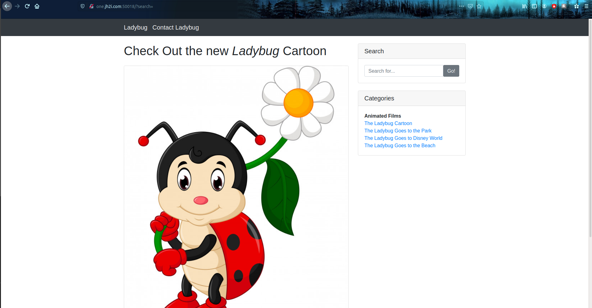
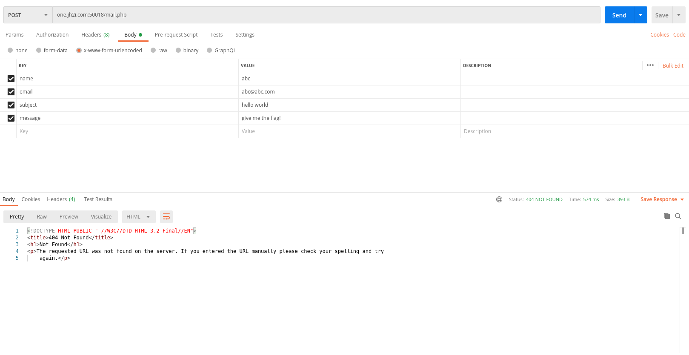

# Challenge: Ladybug

## Description:
```
Want to check out the new Ladybug Cartoon? It's still in production, so feel free to send in suggestions!

Connect with one instance below:
http://one.jh2i.com:50018
http://two.jh2i.com:50018
http://three.jh2i.com:50018
http://four.jh2i.com:50018
http://five.jh2i.com:50018
http://six.jh2i.com:50018
```
## Points: 100

I opened up the first site:

The first thing I did was to examine the source code of the site, but I found nothing worth investigating except the images, the contact page and the search bar. First I checked the searchbar for any SQL injections, but the searchbar doesn't return anything, so I moved on to the contact form and tried to send an example message and it did not send, that's because the button is an anchor tag that doesn't point to anything, so we need to use nc for this. I tried to open the mail.php site via a browser but the site returned a 404 status error. I opened up postman and sent an example POST request to the site:

No luck. It was time to go to the next site.

After opening the next site I realized that all the sites are the same. So I attempted to focus only on the most important parts, which are the searchbar and the contact form. I checked for errors in the GET request by changing the parameter to an array using `?search[]=`, the result did not change the behaviour of the sites. The next thing was the contact form. After sending the same POST request to all websites which failed my expectations, I tried to examine the page without the subdomain in the URL, which gave the the same page as the rest of them.

I also realized that there are more subdomains than in the description, so I also sent a POST request to them.