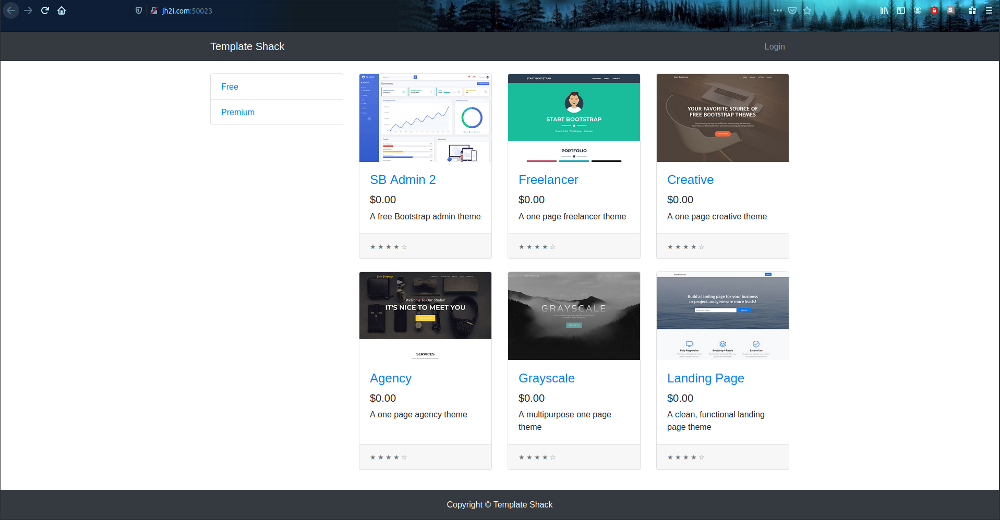
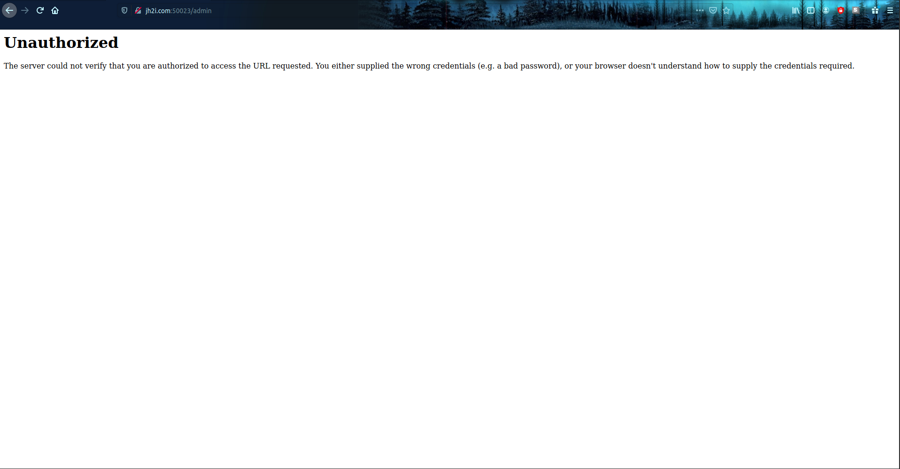
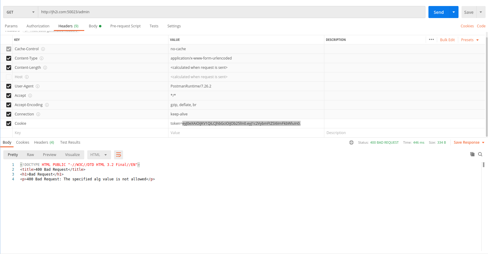

# Challenge: Template Shack

## Description: Check out the coolest web templates online! Connect here: http://jh2i.com:50023

## Points: 150

We are greeted with the following page:

After examining the source code for all the pages, I retrieved the following interesting information:
- http://jh2i.com:50023/
    - `<!-- TODO: Finish developing the admin section and add functionality to manage the templates -->` in the head tag of the page.
- http://jh2i.com:50023/login
    - A POST form leading to `/login` with the following parameters:
        - `username`
        - `password`

After that I attempted to try and find the said "admin section" by accessing to /admin and the following page appeared:

I opened postman and tried using POST to login, but that failed because it is forbidden to use that method on this webpage. The next thing I did was inspecting the cookie. The cookie looked like a JWT token so I decoded it in base64 and got the following result: `{"typ":"JWT","alg":"HS256"}{"username":"guest"}=J1;h5}#FaFV&>0iK@`. I attempted to try to replace the username to "admin". The result was a failure because I would need to know the secret key to make the JWT token valid. I tried once more with a JWT token with different secret keys to see if those were to be valid.

`Server: Werkzeug/1.0.1 Python/3.6.9`

The main focus here is the admin page, mainly because the comment said that the page is in developement, which means that there is a problem in the JWT token itself, or the page. I entered to `/admin/` and found an Internal Server Error (500). I further attempted to break the JWT token by changing the algorithm with "None" using the tool called [TokenBreaker](https://github.com/Goron/TokenBreaker) and inputted the following token `eyJ0eXAiOiJKV1QiLCJhbGciOiJOb25lIn0.eyJ1c2VybmFtZSI6ImFkbWluIn0.` as the cookie token. I recieved the following response:

